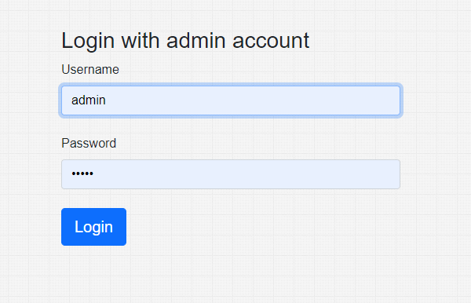

# Task 1
- Change directory to ```task1``` folder

### 1.1
- Run ``` node task1_1.js ```
- Enter a letter-only, non-empty string without spaces.
- Receive a alphabetical sorted string.


### 1.2
- Run ``` node task1_2.js ```
- Enter a uppercase letters only, non-empty string data without spaces.
- Receive Run-length encoded string.


### 1.3
- Manually fix ``` input_arr ``` and ``` k ``` in the code


- Run ``` node task1_3.js ```
- Receive true/false, idicating whether any two numbers from the list add up to k.


<br><br>


# Task 2
## 1. Deployed application using AWS hosting
### Deployment details:
- AWS Ubuntu Server 20.04 LTS
- MongoDB Atlas
- Utilize Pm2 process manager and Nginx reverse proxy

### Application URLs:
- ``` http://18.118.215.192 ``` : Admin login page
- ``` http://18.118.215.192/user-management ```: User management page
- When login, please use the following credentials
    - ``` username: admin ```
    - ``` password: admin ```




## 2. Test locally
### Back-end Nodejs, Express setup
```bash
# Change directory to back-end folder
cd task2_and_3/backend

# Install npm dependencies
npm install

# Start app
npm run start

```

### Frond-end Reactjs setup
```bash
# Change directory to front-end folder
cd task2_and_3/frontend-react

# Install npm dependencies
npm install

# Start app
npm run start

```

<br><br>

# Task 3
- Unable to implement in restricted time.


Prerequisites
-------------

- [Node.js](http://nodejs.org)
- [Express](https://expressjs.com/)
- [React.js](https://reactjs.org/)
